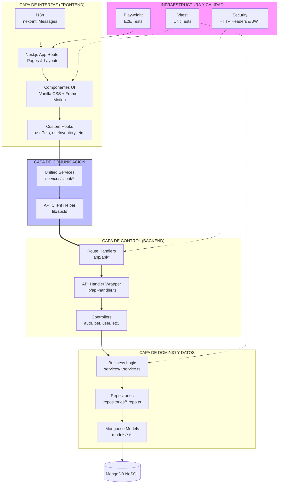

# Arquitectura Técnica - Veterinaria DrPaw

Este diagrama representa la estructura actual del proyecto, incluyendo las optimizaciones recientes en la capa de servicios, seguridad y testing.

## Detalles de las Capas

### 1. Capa de Interfaz
Utiliza **Next.js 16+** con el App Router. La UI se basa en componentes atómicos en `components/ui/` y lógica de estado encapsulada en `hooks/`. El multilenguaje se gestiona globalmente mediante `next-intl`.

### 2. Capa de Comunicación (Consolidada)
Centraliza todas las peticiones al backend en `services/client/`. Utiliza un cliente base (`lib/api.ts`) que gestiona tokens JWT de forma automática y estandariza las respuestas.

### 3. Capa de Control
Los **Route Handlers** delegan la lógica a los **Controllers**. Se utiliza un `apiHandler` de alto orden para centralizar:
- Conexión automática a base de datos.
- Validación de esquemas con **Zod**.
- Gestión de errores uniforme.
- Protección de rutas por roles (RBAC).

### 4. Capa de Dominio y Datos
Sigue el patrón **Repository**, separando la lógica de negocio (`services/`) del acceso a datos (`repositories/`). Esto facilita el testing y el mantenimiento a largo plazo.

### 5. Infraestructura y Calidad
- **Testing**: Cobertura dual con Vitest (unidad) y Playwright (extremo a extremo).
- **Seguridad**: Implementación de cabeceras HTTP de seguridad (HSTS, CSP, X-Frame-Options) en la configuración de Next.js.

## Módulos Funcionales

El sistema está organizado en los siguientes módulos transversales:

1.  **Gestión de Usuarios**: Registro, login, perfiles y Control de Acceso Basado en Roles (RBAC).
2.  **Gestión de Mascotas**: Inventario de pacientes, propietarios y características clínicas.
3.  **Agenda de Citas**: Programación, estados (pendiente, aceptada, cancelada, completada) y recordatorios por WhatsApp.
4.  **Historias Clínicas**: Registro detallado de consultas, tratamientos y evolución.
5.  **Catálogo de Servicios**: Gestión de servicios médicos y complementarios.
6.  **Gestión de Inventario**: Stock de productos, medicamentos y movimientos.
7.  **Módulo Financiero**: Ventas, egresos, flujo de caja, activos y pasivos.
8.  **Analítica Avanzada**: Estadísticas, detección de anomalías y reportes financieros.
9.  **Galería de Imágenes**: Gestión de activos visuales para la sección "Sobre Nosotros".
